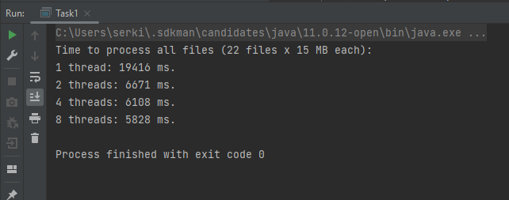

У меня 2 ядерный процессор. Всего 22 файла по 15 МБ каждый (Всего 354 Мб).

Время на парсинг и обработку json файлов:

- 1 thread: **19416 ms**.
- 2 threads: **6671 ms**.
- 4 threads: **6108 ms**.
- 8 threads: **5828 ms**.

Самый существенный прирост при переходе с одного потока на два (в 3 раза).
Если несколько раз позапускать, то у меня в худшем случае прирост был в два раза
(1 поток - около 12000мс, 2 потока - около 6000мс).

Так как у процессора 2 ядра, то на 8 потоках время ненамного меньше чем на 2 потоках.
Т.к. параллельно в лучшем случае (на моем процессоре) могут выполняться два потока.
На 8 потоках тратятся ресурсы на переключения между этими потоками и прирост времени незначительный.

Я так понимаю если увеличивать кол-во потоков еще больше, то время выполнения наоборот
будет увеличиваться по сравнению с 2 потоками (в моем случае).

